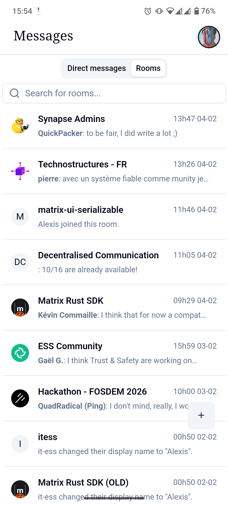
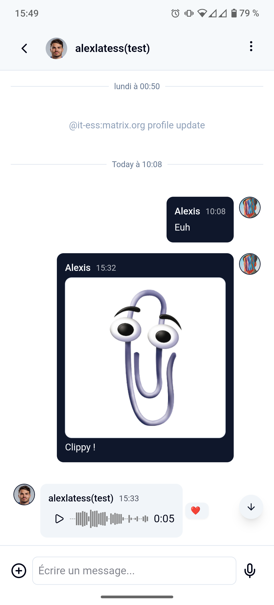
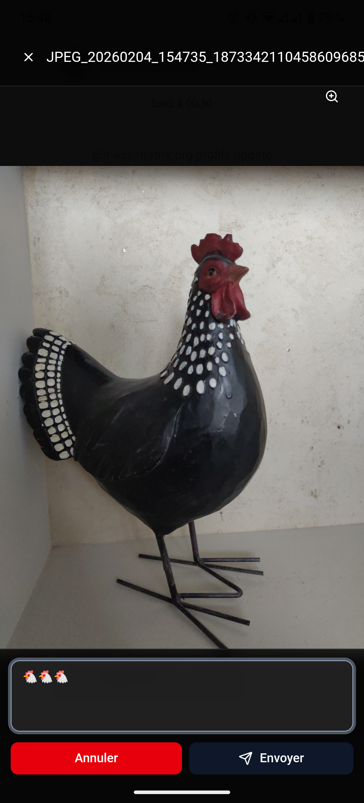

# tauri-plugin-matrix-svelte

A Tauri plugin that provides a high level abstraction of the [Matrix client](https://matrix.org) API and objects.
It is compatible with both desktop and mobile devices.

This plugin is an adapter for the [matrix-ui-serializable](https://github.com/IT-ess/matrix-ui-serializable) library, that wraps the [matrix-rust-sdk](https://github.com/matrix-org/matrix-rust-sdk). 
Most of the state data (Rooms list, Room data) is accessible to the frontend through a Svelte 5 Rune store, allowing easy and fine-grained reactivity of your view.

## Showcase
<div style="display: flex; justify-content: space-between; gap: 15px; margin: 0 -5px; max-width: 100%;">
  
  
  
</div>

You can try the [example client](https://github.com/IT-ess/tauri-plugin-matrix-svelte/tree/main/example/matrix-svelte-client) by installing the binaries (in the Github release), or by compiling the project locally.

## Current supported features

All features supported by [matrix-ui-serializable](https://github.com/IT-ess/matrix-ui-serializable?tab=readme-ov-file#Features).

## Usage

Even if this is a plugin, most of the logic stays tighly related to the example implementation. Thus, it is recommended to use the example client as a starting point.

### Requirements

- If you need to use OAuth authentication (that is the case for matrix.org), you'll need to configure an OAuth client. The example implementation use this preconfigured [website](https://github.com/IT-ess/oauth-redirect-deeplink), that uses deeplinks to pass the OAuth code upon redirect.
- A [Sygnal push notification gateway](https://github.com/matrix-org/sygnal) if you want to configure push notifications on mobile.

### Android network security config

**Required on Android**, otherwise logging in fails against most homeservers with
`invalid peer certificate: Revoked`.

`matrix-rust-sdk` no longer bundles its own root certificates on Android — it delegates to
[`rustls-platform-verifier`](https://github.com/rustls/rustls-platform-verifier), which calls into
Android's Java certificate verifier. Trust anchors come from the system store and work fine, but
the verifier also runs a revocation check, and it has to fetch the leaf's OCSP response or CRL when
the server doesn't staple one. Those endpoints are mandated to be plain `http://` by the CA/Browser
Forum Baseline Requirements, so Android's default "no cleartext traffic" policy blocks the fetch and
the certificate is reported as revoked. See
[rustls-platform-verifier#221](https://github.com/rustls/rustls-platform-verifier/issues/221) and
[matrix-rust-sdk#6319](https://github.com/matrix-org/matrix-rust-sdk/issues/6319).

To fix it in your app:

1. Copy [the example app's `network_security_config.xml`](example/matrix-svelte-client/src-tauri/gen/android/app/src/main/res/xml/network_security_config.xml)
   to `src-tauri/gen/android/app/src/main/res/xml/network_security_config.xml`.
2. Reference it from `<application>` in `src-tauri/gen/android/app/src/main/AndroidManifest.xml`:
   ```xml
   <application android:networkSecurityConfig="@xml/network_security_config" ...>
   ```

Keep the `localhost` / `10.0.2.2` entries — a `networkSecurityConfig` overrides
`android:usesCleartextTraffic` on API 24+, and without them `tauri android dev` can no longer reach
the dev server.

#### When a homeserver still fails

The CA list is finite, so a homeserver behind a CA that isn't in it will fail the same way. To find
the missing domain:

```bash
# 1. Confirm what is actually failing on the device
adb logcat | grep -iE "rustls|platform-verifier|Revoked|[Cc]leartext"

# 2. Ask the homeserver's certificate which endpoints its CA uses
openssl s_client -connect <host>:443 -servername <host> </dev/null 2>/dev/null \
  | openssl x509 -noout -ext authorityInfoAccess,crlDistributionPoints
```

Take the registrable domain out of each `URI:http://…` (e.g. `http://c.pki.goog/…` → `pki.goog`)
and add it to the CA `<domain-config>` block. Note that homeservers usually delegate via
`.well-known/matrix/client`, so check the delegated host (`matrix-client.example.org`), not just the
server name you typed.

### Plugin configuration

**Required** configuration variables in your `tauri.conf.json` in the plugin part, for the `matrix-svelte` key.
- `android_sygnal_gateway_url`: Push gateway url for android
-	`ios_sygnal_gateway_url`: Push gateway url for iOS
-	`oauth_client_uri`: Client URI for OAuth 
-	`oauth_redirect_uri`: Redirect URI once the OAuth process is validated (must be the same host as redirect)

Optional:
- `ios_app_group`: iOS App Group id (e.g. `group.com.example.app`) shared with a Notification Service Extension. When set, the Matrix store and salt file live in the App Group container and the session is saved in the shared keychain access group (with `after-first-unlock` accessibility), so the NSE can decrypt pushed events. **Breaking for existing installs**: enabling it (or changing the value) relocates the store and keychain entry with no migration — users are logged out and must re-authenticate. The `after-first-unlock` accessibility likewise only applies to sessions saved after enabling it.

### Plugin requirements
This plugin works along two other plugins, [tauri-plugin-svelte](https://tb.dev.br/tauri-store/plugin-svelte/guide/getting-started) and [tauri-plugin-notifications](https://github.com/Choochmeque/tauri-plugin-notifications), that also must be initialized with default capabilities by your Tauri app before this plugin.

### Usage in Svelte

#### Stores
The `tauri-plugin-matrix-svelte-api` NPM package exposes the types and classes you need. 
Basically, you get four kind of classes / Rune stores : 
- `RoomsCollection`: that contains all the informations to implement the rooms list view of your client
- `RoomStore`: a store that contains the timeline and other info related to a currently opened room
- `ProfileStore`: a store that contains a Map of all known users profile (avatar, name...)
- `LoginStore`: a store that contains information about the logged in user

These stores must be instantiated upon webview creation, in the `hooks.client.ts`.

#### Commands and events
Command wrappers and event types are exposed by the NPM package.
The exposed commands cover the basic operations of a Matrix client.
A lot of requests are async, and should be submitted with the `submitAsyncRequest` command.

## Building

### Building the javascript bindings

- `pnpm install`
- `pnpm build`

### Building the Rust lib

- `cargo build`

## Main Dependencies

- [matrix-ui-serializable](https://github.com/IT-ess/matrix-ui-serializable) : high level abstraction of a Matrix client in Rust
- [tauri-plugin-svelte](https://github.com/ferreira-tb/tauri-store/tree/main/packages/plugin-svelte): to communicate easily with Svelte frontend in a reactive way
- [keyring-core](https://github.com/open-source-cooperative/keyring-core) : to store the Matrix session securely in the OS keychain

# Contributing
This project is opened to all kinds of contributions. I'm aware that the [documentation](https://docs.rs/tauri-plugin-matrix-svelte) isn't exhaustive and I do not have enough time to make it so. I can still [answer some questions](#chat-about-this-project) if needed !

## Possible improvements

As mentionned in [matrix-ui-serializable's README](https://github.com/IT-ess/matrix-ui-serializable?tab=readme-ov-file#possible-improvements), the main flaw of this plugin is the full serialization of the stores whenever the state_updaters are called. To avoid serialization, passing data directly to the frontend through Tauri's raw IPC API may be possible, but that would require extra work that is perfectly done by tauri-plugin-svelte right now.
The current implementation is a memory hog, especially with accounts with a lot of rooms. This could be improved with better room / room list pagination. 

## Chat about this project

Join this [Matrix room](https://matrix.to/#/#matrix-ui-serializable:matrix.org) if you have questions about this project !


# Special thanks to :

- To [Andrew Ferreira](https://github.com/ferreira-tb) for its handy tauri-plugin-svelte plugin.
- To the whole Tauri team for their awesome platform to build on.
- And of course to the whole Matrix team and ecosystem !
