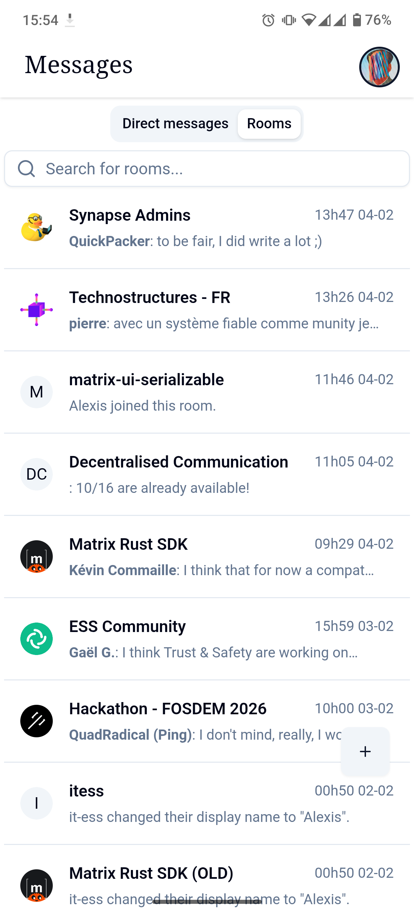
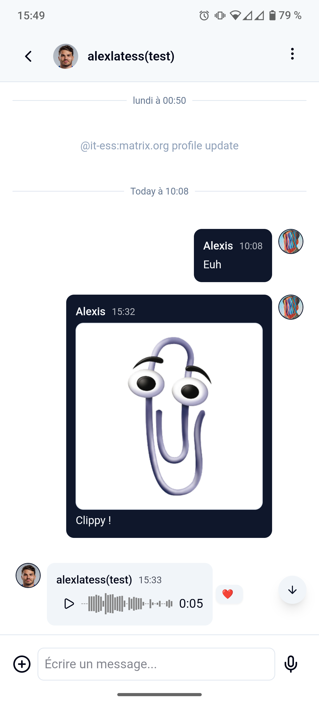
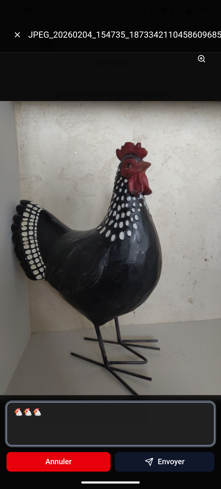

# tauri-plugin-matrix-svelte

A Tauri plugin that provides a high level abstraction of the [Matrix client](https://matrix.org) API and objects.
It is compatible with both desktop and mobile devices.

This plugin is an adapter for the [matrix-ui-serializable](https://github.com/IT-ess/matrix-ui-serializable) library, that wraps the [matrix-rust-sdk](https://github.com/matrix-org/matrix-rust-sdk).
Most of the state data (Rooms list, Room data) is accessible to the frontend through a Svelte 5 Rune store, allowing easy and fine-grained reactivity of your view.

## Showcase

<div style="display: flex; justify-content: space-between; gap: 15px; margin: 0 -5px; max-width: 100%;">
  
  
  
</div>

You can try the [example client](https://github.com/IT-ess/tauri-plugin-matrix-svelte/tree/main/example/matrix-svelte-client) by installing the binaries (in the Github release), or by compiling the project locally.

## Current supported features

All features supported by [matrix-ui-serializable](https://github.com/IT-ess/matrix-ui-serializable?tab=readme-ov-file#Features).

## Usage

Even if this is a plugin, most of the logic stays tighly related to the example implementation. Thus, it is recommended to use the example client as a starting point.

### Requirements

- If you need to use OAuth authentication (that is the case for matrix.org), you'll need to configure an OAuth client. The example implementation use this preconfigured [website](https://github.com/IT-ess/oauth-redirect-deeplink), that uses deeplinks to pass the OAuth code upon redirect.
- A [Sygnal push notification gateway](https://github.com/matrix-org/sygnal) if you want to configure push notifications on mobile.

### Android TLS setup (rustls-platform-verifier)

**Required on Android**, otherwise every HTTPS request to the homeserver fails.

`matrix-rust-sdk` no longer bundles its own root certificates on Android. It delegates to
[`rustls-platform-verifier`](https://github.com/rustls/rustls-platform-verifier), which calls into Android's
Java certificate verifier through a small Kotlin component. Your app needs three things:

1. **The crate**, version `0.7.1` or later, as a dependency of your app (`src-tauri/Cargo.toml`). It has to
   resolve to the same single copy `reqwest` uses, otherwise you initialize one copy and matrix-sdk uses the
   other. Check with `cargo tree -i rustls-platform-verifier --target aarch64-linux-android`, and if two
   versions show up, run `cargo update -p rustls-platform-verifier@<old version>`.
2. **The Kotlin component**, fetched by Gradle from the Maven repository hosted on the project's GitHub. Its
   version must match the `rustls-platform-verifier-android` crate in your `Cargo.lock`. Copy the
   `repositories` / `RustlsVersion` / `configurations.configureEach` blocks and the unversioned
   `implementation("org.rustls:rustls-platform-verifier")` line from
   [the example app's `build.gradle.kts`](example/matrix-svelte-client/src-tauri/gen/android/app/build.gradle.kts),
   and adjust the relative path to your `Cargo.lock`. See also the
   [upstream Gradle setup](https://github.com/rustls/rustls-platform-verifier#gradle-setup). The Maven group
   is `org.rustls`. The upstream README's `implementation "rustls:rustls-platform-verifier"` line uses the
   wrong group, so its version rule never applies. If you use R8/Proguard, keep the rule
   `-keep, includedescriptorclasses class org.rustls.platformverifier.** { *; }`.
3. **Initialization** from Rust before any network call, with the Android context. `rustls-platform-verifier`
   0.7 uses `jni` 0.22 while Tauri (wry) is still on `jni` 0.21, so the raw JNI pointers have to be re-wrapped.
   Copy `init_platform_verifier` from
   [the example's `push_handler.rs`](example/matrix-svelte-client/src-tauri/src/push_handler.rs) and call it
   from `setup` via `webview.jni_handle().exec(...)`, as the example's `lib.rs` does. If you handle silent
   pushes natively, also call it from your cold-start init hook.

#### Certificate revocation

The verifier also checks revocation, which usually means downloading the CA's CRL over plain `http://`.
Android blocks cleartext traffic by default, which used to surface as a false
`invalid peer certificate: Revoked`
([rustls-platform-verifier#221](https://github.com/rustls/rustls-platform-verifier/issues/221)). Since
`rustls-platform-verifier-android` 0.2.0 (pulled in by `rustls-platform-verifier` 0.7.1), the AAR ships its own
network security config: cleartext is allowed only for the CRL hosts listed in the CCADB, and Android's manifest
merger adds it to your app automatically. Nothing needs to be configured.

**Don't declare your own `android:networkSecurityConfig`** in `AndroidManifest.xml`, and don't add a
`res/xml/network_security_config.xml`. Either one replaces the library's config and brings the false
`Revoked` errors back. This also means user-installed CAs are no longer trusted by the platform verifier,
because Android's default applies.

If a homeserver still fails with `Revoked`, its CA's CRL host is probably missing from the upstream list.
Confirm on the device with:

```bash
adb logcat | grep -iE "rustls|platform-verifier|Revoked|[Cc]leartext"
```

Then report it upstream, or bump `rustls-platform-verifier` if a newer release has already added it.

### Plugin configuration

**Required** configuration variables in your `tauri.conf.json` in the plugin part, for the `matrix-svelte` key.

- `android_sygnal_gateway_url`: Push gateway url for android
- `ios_sygnal_gateway_url`: Push gateway url for iOS
- `oauth_client_uri`: Client URI for OAuth
- `oauth_redirect_uri`: Redirect URI once the OAuth process is validated (must be the same host as redirect)

Optional:

- `ios_app_group`: iOS App Group id (e.g. `group.com.example.app`) shared with a Notification Service Extension. When set, the Matrix store and salt file live in the App Group container and the session is saved in the shared keychain access group (with `after-first-unlock` accessibility), so the NSE can decrypt pushed events. **Breaking for existing installs**: enabling it (or changing the value) relocates the store and keychain entry with no migration — users are logged out and must re-authenticate. The `after-first-unlock` accessibility likewise only applies to sessions saved after enabling it.

### Plugin requirements

This plugin works along two other plugins, [tauri-plugin-svelte](https://tb.dev.br/tauri-store/plugin-svelte/guide/getting-started) and [tauri-plugin-notifications](https://github.com/Choochmeque/tauri-plugin-notifications), that also must be initialized with default capabilities by your Tauri app before this plugin.

### Usage in Svelte

#### Stores

The `tauri-plugin-matrix-svelte-api` NPM package exposes the types and classes you need.
Basically, you get four kind of classes / Rune stores :

- `RoomsCollection`: that contains all the informations to implement the rooms list view of your client
- `RoomStore`: a store that contains the timeline and other info related to a currently opened room
- `ProfileStore`: a store that contains a Map of all known users profile (avatar, name...)
- `LoginStore`: a store that contains information about the logged in user

These stores must be instantiated upon webview creation, in the `hooks.client.ts`.

#### Commands and events

Command wrappers and event types are exposed by the NPM package.
The exposed commands cover the basic operations of a Matrix client.
A lot of requests are async, and should be submitted with the `submitAsyncRequest` command.

## Building

This repo is a single Cargo workspace and a single pnpm workspace, both rooted here: the plugin and the
`example/matrix-svelte-client` app share one `Cargo.lock`/`target/` and one `node_modules`. Install once from
the repo root.

### Building the javascript bindings

- `pnpm install` (from the repo root, installs the example app too)
- `pnpm build`

### Building the Rust lib

- `git submodule update --init` (fetches the `tauri-plugin-notifications` submodule)
- `cargo build`

## Main Dependencies

- [matrix-ui-serializable](https://github.com/IT-ess/matrix-ui-serializable) : high level abstraction of a Matrix client in Rust
- [tauri-plugin-svelte](https://github.com/ferreira-tb/tauri-store/tree/main/packages/plugin-svelte): to communicate easily with Svelte frontend in a reactive way
- [keyring-core](https://github.com/open-source-cooperative/keyring-core) : to store the Matrix session securely in the OS keychain

# Contributing

This project is opened to all kinds of contributions. I'm aware that the [documentation](https://docs.rs/tauri-plugin-matrix-svelte) isn't exhaustive and I do not have enough time to make it so. I can still [answer some questions](#chat-about-this-project) if needed !

## Possible improvements

As mentionned in [matrix-ui-serializable's README](https://github.com/IT-ess/matrix-ui-serializable?tab=readme-ov-file#possible-improvements), the main flaw of this plugin is the full serialization of the stores whenever the state_updaters are called. To avoid serialization, passing data directly to the frontend through Tauri's raw IPC API may be possible, but that would require extra work that is perfectly done by tauri-plugin-svelte right now.
The current implementation is a memory hog, especially with accounts with a lot of rooms. This could be improved with better room / room list pagination.

## Chat about this project

Join this [Matrix room](https://matrix.to/#/#matrix-ui-serializable:matrix.org) if you have questions about this project !

# AI Notice

This project uses AI agent tools for some tasks.
Most of the code remains human-written, and all of the merged code has been reviewed by a human. AI commits are marked as such in the description / co-author field.

# Special thanks to :

- To [Andrew Ferreira](https://github.com/ferreira-tb) for its handy tauri-plugin-svelte plugin.
- To the whole Tauri team for their awesome platform to build on.
- And of course to the whole Matrix team and ecosystem !
