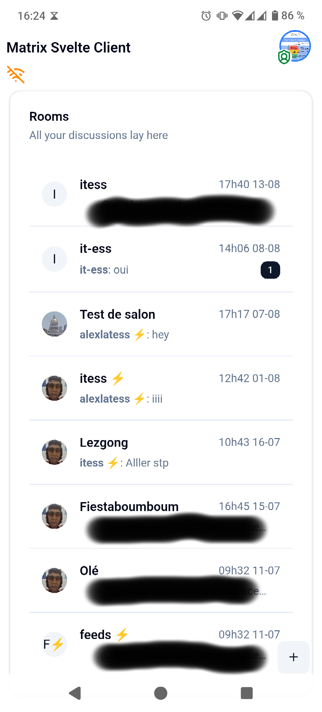

# tauri-plugin-matrix-svelte

A Tauri plugin that provides Matrix communication features through Svelte Rune stores.

This plugin is an adapter for the [matrix-ui-serializable](https://github.com/IT-ess/matrix-ui-serializable) library, that provides high abstractions of the client state. Most of the state data is sent to frontend through Svelte Rune Stores directly, thanks to tauri-plugin-svelte, allowing instant reactivity.

## Showcase

  
  
  

You can try the example client by installing the binaries (in the Github release).

## Current supported features

Check [here](https://github.com/IT-ess/matrix-ui-serializable?tab=readme-ov-file#Features).

## Installation

TODO !

## Requirements

- If you need to use OAuth authentication (that is the case for matrix.org), you'll need a callback URL that passes the OAuth state to your client. You can use this preconfigured [project](https://github.com/IT-ess/oauth-redirect-deeplink), and replace with your environment variables.
- A [Sygnal push notification gateway](https://github.com/matrix-org/sygnal) if you want to configure push notifications on mobile.

## Plugin configuration
- `android_sygnal_gateway_url`: Push gateway url for android
-	`ios_sygnal_gateway_url`: Push gateway url for iOS
-	`oauth_client_uri`: Client URI for OAuth 
-	`oauth_redirect_uri`: Redirect URI once the OAuth process is validated (must be the same host as redirect)

## Building

### Building the javascript bindings

- `pnpm install`
- `pnpm build`

### Building the Rust lib

- `cargo build`

## Main Dependencies

- [tauri 2.0](https://tauri.app/) : allowing one codebase for 5 platforms
- [matrix-ui-serializable](https://github.com/IT-ess/matrix-ui-serializable) : high level abstraction of a Matrix client in Rust
- [tauri-plugin-svelte](https://github.com/ferreira-tb/tauri-store/tree/main/packages/plugin-svelte): to communicate easily with Svelte frontend in a reactive way

## Special thanks to :

- To [Andrew Ferreira](https://github.com/ferreira-tb) for its handy tauri-plugin-svelte plugin.
- To the whole Tauri team for their awesome platform to build on.
- And of course to the whole Matrix team and ecosystem !
