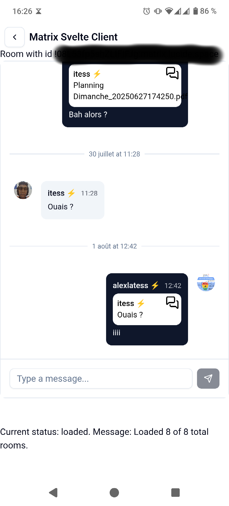

# matrix-svelte-client

An example frontend implementation of the tauri-plugin-matrix-svelte.
**Supports both desktop and mobile devices**.

Build locally, or check Github releases to download the binaries.

# Screenshots

  
  
  

# Usage

## Trying out the app

Check out the pre-built binaries in the [latest release](https://github.com/IT-ess/tauri-plugin-matrix-svelte/releases). 

## Running the app in dev mode

- Check out if you meet Tauri [prerequisites](https://tauri.app/start/prerequisites/)
- Build the tauri-plugin-matrix-svelte TS API: `cd ../.. && pnpm install && pnpm build`
- Install the TS package: `pnpm install`
- [android] : add a keystore.properties file with your keystore data (see [here](https://tauri.app/distribute/sign/android/))
- `pnpm tauri dev` for desktop or `pnpm tauri [android|ios] dev` for mobile

## Caveats

- The mobile Push Notifications shouldn't work right now because I didn't bother configuring a dedicated Sygnal Push gateway.
- Recording audio messages isn't possible on Linux, since WebKit2GTK doesn't implement this feature yet.
- On Linux with Nvidia drivers, Tauri apps fail to start unless you use this env variable `WEBKIT_DISABLE_DMABUF_RENDERER=1`

# Implementation details

This client uses deeplinks to implement the OAuth login flow, with the [oauth-redirect-deeplink](https://github.com/IT-ess/oauth-redirect-deeplink) site to handle redirects. This can be done in another way, for example with the [tauri-plugin-oauth](https://github.com/FabianLars/tauri-plugin-oauth).
I found out this method to be more reliable, especially on mobile devices.

The UI is mostly adapted for mobile usage, using shadcn-svelte components and Tailwind. The theme can easily be customized (check `app.css`).
